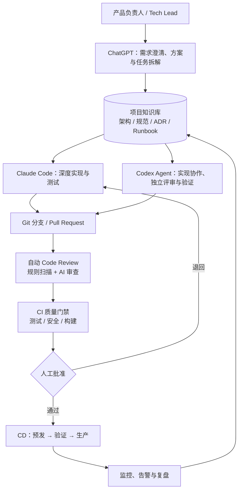
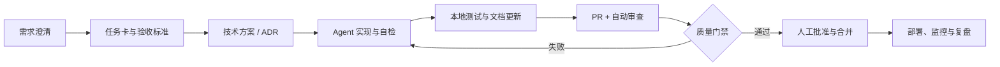
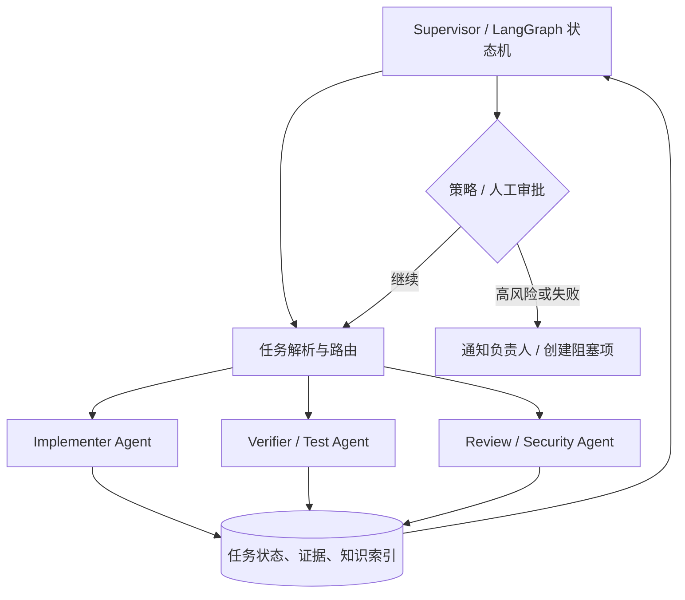
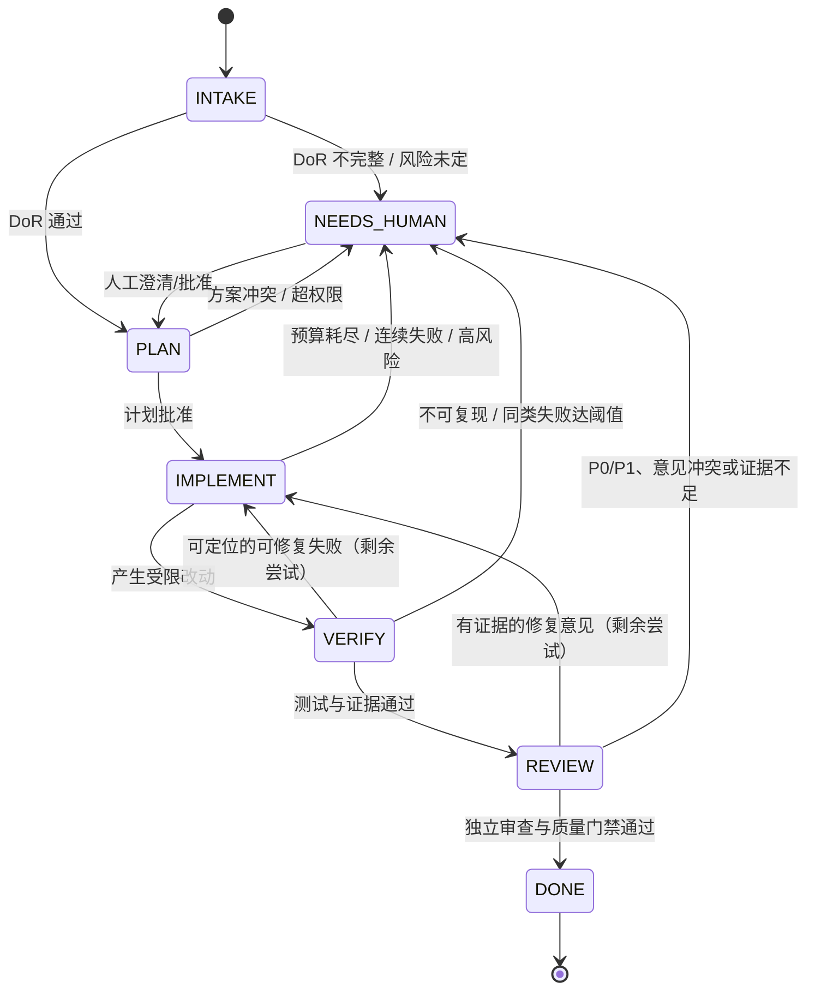

# WebDB 项目 AI 协作开发体系方案

> 版本：v1.1｜状态：可执行实施蓝图｜更新：2026-07-11｜适用范围：WebDB 的产品、前端、后端、数据库、平台与运维工作

> 本次修订将 v1.0 的治理与流程蓝图补全为可运行的操作规范：新增提示词契约、模型/成本控制、编排状态机、异常与冲突处理、上下文管理、Agent 权限治理、质量度量与人机交接规则。模型名称与单价变化较快，项目配置以受控的模型注册表为准，而不把具体价格写死在本方案中。

## 1. 目标与原则

本方案将 AI 纳入 WebDB 的日常研发闭环：由人负责目标、边界、授权与最终决策；由 Agent 承担调研、拆解、实现、验证、审查和文档沉淀。目标不是增加一层聊天工具，而是形成可追溯、可验证、可持续优化的工程系统。

核心原则：

- **规格先行**：任何非微小改动先有可验收的任务说明，再进入编码。
- **证据优先**：Agent 的结论应附带代码位置、测试结果、日志或文档依据；不以“已完成”的文字作为验收。
- **最小授权**：默认只读；写代码、创建分支、发布、访问生产环境分别授权。
- **小批量交付**：一个 PR 聚焦一个可独立验证的目标，避免把重构、功能和依赖升级混在一起。
- **知识回流**：缺陷、决策、评审规则和运行手册必须回写知识库，减少下一次重复探索。

## 2. AI 软件团队总体架构



### 2.1 分层设计

| 层级 | 职责 | 主要产物 |
| --- | --- | --- |
| 治理层 | 明确业务优先级、风险阈值和发布授权 | Roadmap、PRD、验收标准、发布审批 |
| 协作层 | 分派任务、协调 Agent、维护上下文 | 任务卡、执行计划、Agent 状态、交接摘要 |
| 工程层 | 编码、测试、评审、重构、排障 | 分支、提交、测试、PR、ADR |
| 自动化层 | 执行确定性检查与环境交付 | CI 工作流、扫描报告、制品、部署记录 |
| 知识层 | 保存可复用事实和决策 | `docs/`、`CLAUDE.md`、`AGENTS.md`、Runbook |

## 3. Claude Code / Codex Agent / ChatGPT 的角色分工

| 角色 | 适合承担 | 输入 | 输出 | 不应独自决定 |
| --- | --- | --- | --- |
| ChatGPT | 需求访谈、PRD、方案比较、任务分解、周报与复盘 | 目标、用户反馈、约束、知识库摘要 | 用户故事、验收标准、实施计划、风险清单 | 生产变更、架构最终取舍、无证据的技术结论 |
| Claude Code | 跨文件实现、代码库探索、测试驱动开发、复杂重构 | 已批准任务、`CLAUDE.md`、相关 ADR 与接口契约 | 可运行改动、测试、变更说明、自检证据 | 绕过测试、扩大任务边界、直接发布 |
| Codex Agent | 独立实现、定向调试、PR 审查、安全与回归核验、文档维护 | 任务卡、`AGENTS.md`、PR diff、CI 日志 | 审查意见、修复提交、验证报告、知识更新 | 自我批准、自我合并、生产权限提升 |
| 人类负责人 | 设定方向、处理冲突、审查高风险变更、合并和发布 | 上述全部证据 | 优先级、审批、例外记录 | 把关键决策完全委托给 AI |

建议采用“双 Agent 交叉验证”：实现 Agent 不担任该 PR 的最终 AI 审查者。对于数据库迁移、鉴权、删除/导出数据、计费和基础设施变更，必须保留人工审批。

## 4. 项目知识库设计

知识库以 Git 版本化 Markdown 为主，外部文档平台只存放讨论或附件，并在仓库中保留链接与结论。每份文档标注 Owner、更新时间、适用版本和来源，过期内容不删除而是标记替代关系。

```text
docs/
├─ product/                 # PRD、用户旅程、验收标准、术语表
├─ architecture/            # 系统上下文、模块边界、数据流、ADR
├─ api/                     # OpenAPI、事件契约、错误码
├─ database/                # Schema、迁移约定、数据字典、查询规范
├─ engineering/             # 编码规范、测试策略、Review 规则
├─ operations/              # 环境、部署、监控、事故 Runbook
├─ security/                # 威胁模型、权限矩阵、密钥与依赖策略
├─ tasks/                   # Epic / Story / 实施计划与完成记录
└─ templates/               # PR、ADR、任务卡、提示词模板
```

### 4.1 知识对象与维护机制

| 对象 | 最低内容 | 触发更新 | Owner |
| --- | --- | --- | --- |
| ADR | 背景、候选项、决策、后果、回滚条件 | 架构或关键依赖变化 | Tech Lead |
| 接口契约 | 请求/响应、鉴权、错误、兼容策略 | API 或事件变更 | 模块负责人 |
| 数据字典 | 表/字段语义、敏感等级、生命周期 | Schema 或数据策略变更 | 数据库 Owner |
| Runbook | 告警判断、处置、验证、升级路径 | 事故复盘、部署变更 | SRE/平台 Owner |
| 评审规则 | 规则、严重级别、正反例 | 缺陷复盘、误报校准 | 质量 Owner |

每个任务开始时，Agent 先读取相关索引和文档；每次合并后，PR 模板强制回答“哪些知识文档已更新或为何无需更新”。

## 5. `CLAUDE.md` 与 `AGENTS.md` 模板说明

两者应保存相同的事实性规则，差异在于宿主适配：`CLAUDE.md` 面向 Claude Code，`AGENTS.md` 面向 Codex 及其他 Agent。避免在两处复制长篇架构说明；将稳定内容下沉到 `docs/`，文件内只保留入口与不可违反的约束。

### 5.1 根目录 `CLAUDE.md` 建议模板

````md
# WebDB 开发说明

## 项目目标
- [一句话产品定位]
- 核心模块：`apps/web`、`services/api`、`packages/*`（按实际仓库填写）

## 开始任务前
1. 阅读 `docs/architecture/README.md`、`docs/engineering/coding-standards.md`。
2. 查阅与任务有关的 ADR、接口契约及数据字典。
3. 先给出计划；影响 API、Schema、权限或部署时，等待批准后实施。

## 必须遵守
- 不提交密钥、真实用户数据或生成的本地环境文件。
- 数据库变更必须提供可回滚迁移与迁移验证。
- 对外接口保持向后兼容；破坏性变更须 ADR 与版本策略。
- 修改行为必须补充或更新测试；不得删测来让 CI 通过。

## 常用命令
```sh
[安装、Lint、单测、集成测、构建、迁移命令]
```

## 完成定义
- 任务验收项逐项满足，相关测试通过。
- 更新必要的文档、变更日志和任务状态。
- 提交 PR 前运行 `git diff` 并说明风险、验证证据及回滚方式。
````

### 5.2 根目录 `AGENTS.md` 建议模板

```md
# WebDB Agent 工作协议

## 范围与优先级
用户任务 > 本文件 > 目录级 AGENTS.md > 文档规范。发现冲突时停止并说明冲突。

## 任务协议
1. 复述目标、非目标和验收标准；不明确时列出假设。
2. 先搜索代码和文档，提出最小改动计划。
3. 按既有模块边界实现；不要顺手重构无关代码。
4. 执行与改动匹配的验证，报告命令与结果。

## 审查重点
- 权限校验、租户隔离、参数化查询、审计日志。
- 迁移可回滚、索引影响、长事务与大表风险。
- API 兼容、错误处理、观测性、测试覆盖。

## 禁止事项
- 不直接修改生产数据或关闭安全检查。
- 不将令牌、密码、连接串写入代码、日志或 PR。
- 未授权不得合并、发布或变更基础设施权限。
```

可在子目录放置更具体的 `AGENTS.md`，例如 `services/api/AGENTS.md` 补充接口与迁移规则，`apps/web/AGENTS.md` 补充 UI、可访问性和 E2E 规则；子规则只能收紧，不应与根规则相矛盾。

## 6. 标准开发流程



1. **澄清与拆解**：ChatGPT 将需求转成 Epic、用户故事和任务卡；每张卡必须包含背景、范围、非目标、验收标准、风险、依赖和回滚提示。
2. **方案评审**：涉及模块边界、接口、数据模型、权限、性能或部署的工作先产出轻量设计；关键取舍写入 ADR。
3. **实施**：Claude Code 或 Codex 按任务卡在独立分支完成最小改动，并同步补充单元/集成/E2E 测试。
4. **自检**：实现 Agent 运行格式化、静态检查、相关测试和构建；提交前核对 diff、迁移、配置和文档。
5. **评审与合并**：自动门禁、独立 AI Review 和人工 Review 均通过后合并；高风险变更执行预发验证。
6. **回流**：发布后观察关键指标；缺陷或事故形成复盘、测试用例和规则更新。

### 6.1 Definition of Ready / Done

| Ready（开始前） | Done（合并前） |
| --- | --- |
| 目标、范围、验收标准明确 | 验收项与相关自动化测试通过 |
| 依赖、数据影响和风险已识别 | Lint、类型检查、构建、扫描均通过 |
| API/Schema/权限影响已声明 | 变更说明、文档和迁移说明已更新 |
| 高风险项已有 Owner 与审批路径 | 回滚方案、监控/告警影响已说明 |

### 6.2 提示词工程与证据契约（P0）

所有 Agent 任务使用版本化模板，保存在 `docs/templates/prompts/`；任务卡只传入模板变量，不以临时口头指令替代模板。每次执行记录模板 ID/版本、模型、输入文档版本、输出、工具调用与验证证据。提示词的固定结构如下：

```text
角色与边界 → 已批准目标 → 非目标/约束 → 已提供上下文与其来源
→ 允许的工具和权限 → 必须执行的验证 → 输出 JSON/Markdown 契约
→ 停止条件与人工升级条件
```

**通用输出契约**：先列出已读取的证据；把事实、推断和待确认事项分开；每项结论提供文件:行号、命令输出、日志链接或文档链接；没有证据时明确写“不确定”，不得编造命令、测试结果、文件或外部事实。输出必须包含 `scope_check`（是否超出任务卡）、`risks`、`verification` 和 `handoff` 四个字段。

#### 模板 A：需求澄清 / 任务卡

```text
你是 WebDB 产品与技术分析 Agent。根据 [PRD/反馈链接] 和 [知识库索引]，只产出可评审的任务卡，不改代码。
目标：[业务目标]；已知约束：[约束]；禁止假设：[列表]。
先阅读：[文档清单]。将事实标注来源；缺失信息以问题或显式假设列出。
输出：用户场景、范围/非目标、验收标准（可观察且可测试）、数据/API/权限影响、依赖、风险等级、回滚提示、拆分后的 Task（每项一个可验证目标）。
若验收标准、权限影响或数据影响不明确，状态必须为 NEEDS_HUMAN，停止，不自行补全。
```

#### 模板 B：TDD 实现

```text
你是实现 Agent。只完成任务 [TASK-ID]；不得修改其非目标。
读取：[任务卡、相关 ADR、目录级 AGENTS.md、接口契约]，先报告现状证据和最小计划，等待/取得批准后再编辑。
按 Red → Green → Refactor：先新增或调整能失败的测试，运行并记录失败；实施最小改动；运行 [验证命令]；仅在测试通过后做受限重构。
不得跳过测试、扩大 schema/API、修改生产配置或使用未授权工具。遇到契约冲突、权限/迁移/数据删除、连续两次同类失败即停止升级。
输出：改动文件与原因、测试先失败的证据、最终验证命令和原始结果、未解决风险、回滚办法、交接摘要。
```

#### 模板 C：独立 Code Review

```text
你是独立审查 Agent，不得认可“作者说已完成”作为证据。
输入：[任务卡] [PR diff] [CI 结果] [相关 ADR/安全规则]。先核对目标、非目标和每条验收标准，再审查变更及其相邻影响面。
重点检查：权限与租户隔离、SQL/迁移、错误处理、兼容性、并发/性能、日志脱敏、测试是否真正覆盖风险。
每条问题必须按 P0-P3 给出文件:行号、可验证事实、影响、复现/推理和最小修复建议；证据不足则列为“待确认”，不得阻断。
最后输出验收矩阵（通过/失败/证据不足）、漏测建议、结论（approve/request changes/escalate）和置信度。
```

模板必须做小样本回归：每次修改以不少于 10 个已知任务/缺陷运行，比较关键问题召回、误报和人工改写率；指标恶化时不得直接替换生产模板。

### 6.3 上下文窗口与交接管理（P2）

- **任务粒度**：单次实现以一个可独立验证的行为、一个模块边界和预期不超过 5–8 个核心文件为目标；超过时先拆为探索、契约、分批实现与集成验证任务。
- **分层上下文**：始终注入任务卡、目录级规则和相关契约；按需检索 ADR、调用链和最近变更；不把整仓库、无关日志或长对话直接塞入提示词。
- **压缩规则**：每轮只保留已验证事实、决策、未决问题、变更清单、命令/结果与下一步；摘要必须附来源链接，未经验证的模型结论不能进入长期记忆。
- **交接包**：上下文切换、超过预算或换 Agent 时写入 `docs/tasks/<task-id>-handoff.md`，包含目标/非目标、当前状态、已读文件、已改文件、验证结果、失败尝试、风险、下一条可执行命令和需要人类决定的问题。接手者先验证交接包中的关键事实。

## 7. 自动 Code Review 流程

自动审查用于发现问题和提供证据，不能替代合并责任。检查按“快速、确定性、语义”三层执行：

| 阶段 | 检查 | 结果处理 |
| --- | --- | --- |
| 预提交 | 格式化、Lint、类型检查、敏感信息扫描 | 阻止明显错误进入远端 |
| PR CI | 单测、集成测、构建、依赖与许可证扫描、覆盖率变化 | 阻断 P0/P1 风险与基础质量失败 |
| AI Review | 基于 diff、任务卡、架构/安全规则做语义审查 | 输出可定位、可复现的意见；由作者或 Reviewer 判断 |
| 合并前 | 独立 Reviewer、CODEOWNERS、变更风险核验 | 高风险项必须人工批准 |

### 7.1 AI Review 输出规范

每条意见应包含：严重级别（P0–P3）、文件与行号、问题事实、影响范围、复现或依据、建议修复方式。无法指出具体证据的“泛化建议”不作为阻断项。

| 级别 | 含义 | 合并策略 |
| --- | --- | --- |
| P0 | 数据泄露、越权、不可恢复的数据破坏、生产中断 | 必须修复，升级人工处理 |
| P1 | 明确缺陷、安全/兼容风险、关键性能退化 | 必须修复或记录批准的例外 |
| P2 | 可维护性、测试或边界缺失 | 应修复或创建有 Owner 的后续任务 |
| P3 | 风格或可选优化 | 不阻断，按团队约定处理 |

WebDB 专项规则至少覆盖：SQL 注入与参数绑定、租户/项目隔离、权限最小化、数据库迁移锁表和回滚、查询计划与索引、连接池、分页上限、导入导出审计、错误信息脱敏、日志中无凭据。

## 8. Git + CI/CD 自动化方案

### 8.1 Git 策略

- 长期分支仅保留 `main`（始终可发布）；功能使用短生命周期分支：`feat/<task-id>-<slug>`、`fix/<task-id>-<slug>`、`chore/<slug>`。
- 每个分支对应一个任务卡与一个主题明确的 PR；采用 Conventional Commits，例如 `feat(query): add saved query filters`。
- `main` 受保护：禁止直接推送、必须通过 CI、必须通过 CODEOWNERS 和人工审批；高风险路径（迁移、鉴权、部署）要求相应 Owner。
- 使用 squash merge 保持主线历史清晰；发布以带注释的语义化标签触发。

### 8.2 CI 门禁建议

```text
PR 创建/更新
  ├─ 格式化、Lint、类型检查
  ├─ 单元测试 + 覆盖率差异
  ├─ 集成测试（临时数据库/服务）
  ├─ 构建与依赖锁定校验
  ├─ SAST、秘密扫描、依赖漏洞与许可证扫描
  ├─ 数据库迁移：up/down、干跑、兼容性检查
  ├─ AI Review（任务上下文 + diff + 规则库）
  └─ 汇总质量报告 → 满足分支保护规则后可合并
```

### 8.3 CD 推进模型

| 环境 | 触发 | 必做验证 | 发布策略 |
| --- | --- | --- | --- |
| Preview | PR 更新 | 冒烟测试、UI/E2E、迁移干跑 | 自动创建、PR 关闭即回收 |
| Staging | 合并到 `main` | 集成回归、性能基线、安全验证 | 自动部署；高风险变更需批准 |
| Production | 发布标签/手动批准 | 健康检查、关键指标、备份与回滚确认 | 灰度/金丝雀；异常自动停止或回滚 |

部署流水线须使用环境级密钥管理、最小权限身份和不可变制品。数据库生产迁移独立为受控步骤：先备份与兼容性校验，再迁移、健康检查，必要时执行既定回滚或前向修复。

## 9. Supervisor Agent 后续扩展方向

Supervisor 不是拥有无限权限的“总控 AI”，而是具备状态机、策略和人工升级机制的编排器。第一阶段只做建议、分派和汇总；稳定后再逐步开启低风险自动动作。



### 9.1 MCP + LangGraph 设计要点

- **MCP 服务层**：Git/PR、任务系统、文档检索、CI、制品库、监控和部署分别提供最小范围工具；工具声明读写权限、审计字段、速率限制和幂等键。
- **LangGraph 状态层**：状态至少包含任务 ID、目标、约束、风险、已用工具、证据链接、重试次数、审批状态和预算；节点之间传递结构化 JSON，避免只依赖自然语言摘要。
- **策略层**：按风险路由。低风险文档/测试修复可自动迭代；权限、迁移、生产和成本超阈值操作必须中断等待人类批准。
- **记忆层**：短期保存任务上下文；长期只沉淀经审核的 ADR、规则、失败模式和指标，避免把未经验证的对话写入知识库。
- **可观测性**：记录模型、提示词版本、工具调用、令牌/成本、耗时、失败原因与人工覆盖率，用于评估而非仅展示。

## 10. 任务管理体系

采用“路线图 → Epic → Story → Task → PR/部署”的可追溯层级，任务编号贯穿分支、提交、PR、日志和复盘。

| 类型 | 说明 | 必填字段 |
| --- | --- | --- |
| Epic | 可交付的业务能力或较大工程目标 | 目标、成功指标、范围、Owner、里程碑、风险 |
| Story | 可从用户或系统视角验收的能力 | 场景、验收标准、依赖、优先级 |
| Task | 可由一个 Agent/开发者完成的最小工作单元 | 输入、输出、非目标、验证命令、风险等级 |
| Bug | 可复现的偏差 | 环境、复现步骤、期望/实际、影响、回归测试 |
| ADR/Spike | 不确定性探索或决策 | 问题、时限、结论、下一步 |

### 10.1 状态与看板规则

`Backlog → Ready → In Progress → In Review → Blocked / Done`。

- `Ready` 前必须通过 Definition of Ready；`Blocked` 必须写明阻塞事实、需要谁决策、最后更新时间。
- Agent 开始时占用任务、记录计划与预期验证；每次上下文切换写交接摘要，防止重复工作。
- `Done` 以合并和验证证据为准，而非 Agent 回复；发布完成后补充部署关联与观测结果。
- 每周复盘：吞吐量、返工率、CI 失败分布、AI Review 采纳率、P1/P0 漏检、成本与交付周期。

## 11. WebDB 项目实施路线

### 阶段 0：基线与治理（第 1–2 周）

- 梳理 WebDB 模块、环境、数据分级、现有测试和发布路径。
- 建立 `docs/` 结构、术语表、架构图、关键 ADR、根 `CLAUDE.md` 与 `AGENTS.md`。
- 定义任务卡、PR、ADR、交接包与三类 P0 提示词模板，以及风险分级、权限矩阵、人工审批边界和模型注册表。

**验收**：新成员或 Agent 能在 30 分钟内找到启动、测试、架构、接口和发布入口；一个示例任务可完整追溯，并能用模板产出可核验的证据与交接包。

### 阶段 1：研发闭环（第 3–4 周）

- 落地短分支、PR 模板、CODEOWNERS、分支保护和基础 CI。
- 以一个低风险功能试点 ChatGPT 拆解、Claude Code 实现、Codex 独立审查的闭环。
- 对试点记录模型/模板版本、用量、人工复核时间、误报、遗漏和常见命令，写入规则库与知识库。

**验收**：PR 自动运行关键检查；实现与审查角色分离；任务、PR、测试证据和知识更新相互链接；任务预算、人工推翻与有效意见可被查询。

### 阶段 2：质量与交付自动化（第 5–8 周）

- 增加集成测试、临时环境、SAST/秘密/依赖扫描、迁移检查与 AI Review。
- 建立 Preview → Staging → Production 流水线、健康检查、回滚 Runbook 和基础告警。
- 针对 WebDB 增设 SQL、权限、隔离、迁移和性能专项规则，并接入引用校验、范围漂移和循环失败检测。

**验收**：主干可持续部署；高风险变更被可靠拦截或升级；可在预发复现并验证核心链路；生产默认无 Agent 通用访问，策略提升均有审计记录。

### 阶段 3：Supervisor 试点与度量（第 9–12 周）

- 先用只读 MCP 对接任务、Git、CI 和知识检索，构建任务状态面板。
- 按第 15 节状态机和工具契约，将低风险任务纳入 LangGraph 编排：拆解、实施、测试、审查、汇总；高风险节点强制人工中断。
- 建立质量、成本、时延、人工覆盖和故障逃逸指标，运行固定评估集，按月校准模型、提示词和规则。

**验收**：Supervisor 能提供可审计的任务进度与证据，并在策略范围内减少人工协调成本，而不扩大生产风险。

## 12. 首批落地清单

- [ ] 创建 `docs/` 知识库目录和索引页。
- [ ] 按实际技术栈填充根 `CLAUDE.md`、`AGENTS.md` 与子目录规则。
- [ ] 建立任务卡、PR、ADR、事故复盘模板。
- [ ] 建立需求澄清、TDD、独立 Review 提示词模板及版本/回归样本。
- [ ] 建立模型注册表、任务级预算字段、80% 预警与 100% 停止策略。
- [ ] 配置分支保护、CODEOWNERS、提交规范和 PR 检查。
- [ ] 接入格式化、静态分析、测试、构建、秘密扫描和依赖扫描。
- [ ] 编写 WebDB 专属 Review 规则：SQL、权限、隔离、迁移、性能、审计。
- [ ] 建立交接包、引用校验、范围漂移、重复失败和规则绕过检测。
- [ ] 明确 Agent 权限矩阵、数据分级、生产只读观测工具与高风险双人审批。
- [ ] 建立预发环境、发布审批、健康检查、回滚 Runbook。
- [ ] 选择一个低风险 Epic 完成端到端 AI 协作试点并复盘。

## 13. 后续扩展建议

本文档可按以下顺序扩展为项目级可执行资产：

1. **WebDB 专属架构设计**：补充上下文图、容器图、模块边界、数据流、权限模型、Schema 与关键 ADR。
2. **Claude Code Prompt 模板库**：覆盖需求澄清、代码探索、TDD、迁移、排障、文档更新和交接。
3. **Codex Review 规则库**：按通用、前端、后端、数据库、安全和平台分类，提供 P0–P3 正反例。
4. **MCP + LangGraph Supervisor 设计**：定义工具契约、状态机、策略矩阵、审计字段、预算和人工升级流程。
5. **自动化部署方案**：根据 WebDB 实际基础设施补充 IaC、环境变量、制品、灰度、监控、回滚和灾备细节。

## 14. 模型选择、预算与成本控制（P1）

模型由 `docs/engineering/model-registry.md` 统一登记：供应商/模型别名、能力等级、允许的数据等级、输入输出单价、生效日期、备用模型和审批人。工作流只能引用别名（如 `reasoning-high`），不能在脚本或提示词中硬编码易变的型号和价格。

| 工作负载 | 默认能力层 | 升级条件 | 禁止使用高成本模型的情形 |
| --- | --- | --- | --- |
| 分类、格式化、摘要、模板填充 | 经济型 | 低置信度或结构化校验失败 | 可由规则/脚本确定完成的检查 |
| 代码检索、普通实现、测试、首次审查 | 均衡型 | 跨模块设计、两次有效尝试仍失败 | 无任务卡、无最小复现或上下文不全 |
| ADR 比较、复杂排障、安全复审、最终仲裁 | 推理/高能力型 | 人工批准且预期收益高于预算 | 低风险批量任务、无限重试 |

成本在任务、周和月三级受控。任务卡填写 `budget_tokens`、`budget_currency`、`max_tool_calls`、`max_attempts`；编排器在每次模型/工具调用前预估并预留预算，实际用量写入审计日志。默认阈值（试点期，需按真实单价校准）：普通 Task 最多 3 次模型尝试和 12 次工具调用；达到 80% 预算时只允许验证/总结；达到 100% 时停止并生成人工交接包。高能力模型、批量任务和预算例外均需要任务 Owner 批准。

月度报表按任务类型、模型别名、成功率、人工返工、成本/完成任务和成本/有效缺陷展示。优化顺序是缩小上下文、提高缓存/检索命中、用确定性检查替代模型调用、再调整模型；不能仅以“少花 token”为目标而牺牲 P0/P1 召回。

## 15. Supervisor 的可执行状态机与工具契约（P0/P1）

第 9 节的 Supervisor 按以下状态运行；每次状态转移都写入不可变审计事件。`DONE` 只可由门禁证据触发，不能由 Agent 文本触发。



**重试策略**：只对可定位的瞬态工具错误或已有新证据的失败重试；同一命令、同一输入的失败不重复执行。单节点最多 2 次有效重试，整项任务最多 3 次实现循环；超限转 `NEEDS_HUMAN`。网络/权限/密钥错误不重试，直接升级。任何写入前检查幂等键，写入结果返回资源 ID 和可验证版本。

**最小工具契约**：每个 MCP 工具声明 `name`、`read/write/execute` 权限、资源范围、输入 JSON Schema、输出 Schema、幂等键、超时、速率限制、审计字段、错误码和是否需要审批。写工具必须支持 dry-run（若技术上可行）及明确的目标资源；禁止“执行任意 shell”“访问任意 URL”一类宽泛工具。Agent 只能使用任务策略允许的工具集合。

## 16. 异常、幻觉检测与冲突仲裁（P0/P1）

### 16.1 产出可信度检查

| 风险信号 | 自动检测 | 处置 |
| --- | --- | --- |
| 编造文件、行号、命令、测试或链接 | 对引用路径、Git SHA、CI run ID、命令退出码做机器校验 | 标记 `UNVERIFIED`，不进入 Done；要求重新取证 |
| 任务范围漂移 | 将 diff 文件/API/Schema 与任务卡 allowlist 和非目标比对 | 停止合并；拆分额外改动或人工批准例外 |
| 幻觉式结论 | 要求事实-推断分栏，并由独立 Agent/确定性工具抽查 | 证据不足转待确认，不能作为阻断结论 |
| 循环或重复失败 | 按规范化的错误签名、工具调用序列和重试计数检测 | 终止循环、保存交接包、升级人工 |
| 规则绕过 | 检查跳过测试、关闭扫描、扩大权限、修改锁文件/CI 配置 | P1 起步；安全或生产影响按 P0 升级 |

验证 Agent 与实现 Agent 的模型、提示词实例和上下文应尽量独立；至少独立复跑关键测试并核对 diff 与任务卡。无法自动核验的外部事实应注明来源和有效期，由 Owner 确认。

### 16.2 仲裁顺序

1. **确定性证据优先**：测试、编译、策略检查、日志和已批准契约优先于任一 Agent 的意见。
2. **职责 Owner 其次**：接口、数据、安全、平台等领域由 CODEOWNERS/指定 Owner 决定；Agent 提供选项和影响，不代替签字。
3. **双 Agent 分歧**：双方各自提交证据、假设和最小复现；交给未参与实现的仲裁 Agent 只比较证据。仍无法收敛或涉及 P0/P1 时，创建阻塞项交人类负责人。
4. **人类最终决定**：人的决定覆盖 Agent；若与已批准 ADR/安全政策冲突，记录例外、风险接受人、到期日和复审任务，避免“口头覆盖”。

仲裁记录放入任务卡，包含争议、证据、决定、Owner、期限与后续测试/ADR 更新；它也是后续提示词和规则校准的训练样本。

## 17. Agent 权限模型与数据治理（P1）

权限按“环境 × 数据等级 × 动作”授权，凭短期身份令牌、每任务绑定和全量审计实现；默认拒绝，权限不能因模型能力更强而扩大。

| 范围 | Agent 默认权限 | 允许的受控提升 | 明确禁止 |
| --- | --- | --- | --- |
| 源码、公开文档、脱敏测试数据 | 只读；获任务授权后可在隔离分支写入 | 创建 PR、运行受限 CI | 直接合并 main、改分支保护 |
| CI / Preview | 读取日志、运行白名单工作流 | 临时环境部署、受限密钥注入 | 导出密钥、改生产变量 |
| Staging | 只读日志与脱敏指标 | 人工批准的受控部署/迁移演练 | 读取原始用户数据、绕过审计 |
| Production | 默认无访问 | 人工在岗、工单绑定、只读聚合指标或预定义 Runbook | 直接执行 SQL、读取 PII、支付/删除/权限变更 |

生产排障应提供脱敏、聚合、时间受限的观测工具，而不是通用终端。支付、用户数据导出、批量删除、权限授予、密钥轮换和生产迁移都要求双人审批、明确变更窗口与可审计工单。提示词、日志、追踪数据同样按数据等级脱敏和保留；不得把 PII、密钥或生产日志原文发送到未获批准的模型端点。

## 18. 质量评估、可观测性与人机协作体验（P2/P3）

### 18.1 指标与评估集

为常见缺陷、历史事故和安全规则建立去标识化评估集，按版本固定输入和期望结论。模型、提示词、规则、检索或工具变更必须在评估集和小流量试点上比较基线，P0/P1 召回下降即回滚。

| 指标 | 定义 | 用途 |
| --- | --- | --- |
| P0/P1 漏检率 | 合并后发现的 P0/P1 中，评审未提出的比例 | 衡量安全/质量逃逸，优先降低 |
| 有效意见精确率 | 被人工确认有效的 AI 意见 / 全部 AI 意见 | 控制噪声和审查疲劳 |
| 验收一次通过率 | 首次进入 Review 即满足 DoD 的 Task 比例 | 评估任务清晰度与实现质量 |
| 人工覆盖率与推翻率 | 人工改写、拒绝或覆盖 Agent 决策的比例 | 发现权限、提示词或流程失配 |
| 自动化节省时间 | 基线人工耗时 - 人工复核与返工耗时 | 防止“自动化看似忙碌、实际增负” |
| 成本/有效交付与 p95 周期 | 成功 Task 的成本、从 Ready 到 Done 的 p95 时长 | 平衡质量、成本与速度 |

所有指标按风险等级、任务类型、模型/模板版本切片，避免仅看平均数掩盖高风险退化。每周检查趋势，每月由工程/安全/产品共同决定保留、收紧或下线的自动化能力。

### 18.2 开发者日常交互

开发者在 IDE/终端启动 Agent，但任务系统是唯一状态源：每次执行引用 Task ID，PR 自动回写计划、证据、预算和交接包。IDE 适合小范围结对与本地验证；终端/CI 适合可复现的受限执行；高风险决策在 PR/任务系统中留痕，不在聊天记录中批准。

人类只需处理三类队列：`NEEDS_HUMAN`（缺信息、超权限、预算/重试耗尽）、`CONFLICT`（有证据的分歧）和 `HIGH_RISK_APPROVAL`（迁移、权限、生产）。面板应展示“需要什么决定、证据是什么、默认安全动作、截止时间”，而非要求人类重读完整对话。每个试点必须测量人工复核分钟数，若未降低总交付时间或提高质量，应缩小/暂停自动化范围。
