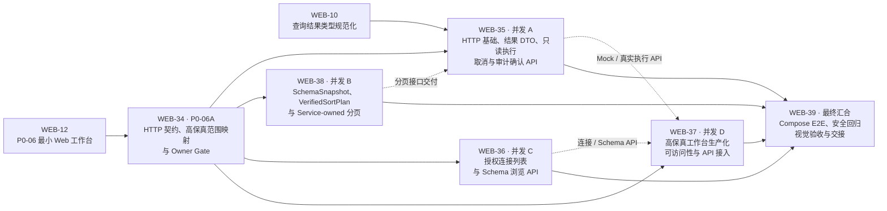

# P0-06：最小 Web 工作台

> 状态：Backlog｜风险：Medium｜依赖：P0-01、P0-03、P0-04；集成 P0-02/P0-05｜建议实现者：Claude Code｜独立审查：Codex

## 目标与范围

提供 React + TypeScript 的最小桌面端界面：连接列表、授权 Schema 树、Monaco SQL 编辑器、运行入口和服务端分页结果表。

不实现登录、多人协作、数据行编辑、导出、写操作、移动端或前端直连数据库。

## 验收标准

| 验收项 | 证据 |
| --- | --- |
| UI 只经 API 显示已授权连接/Schema，绝不暴露连接密钥 | E2E/网络响应测试 |
| 编辑器运行只读 SQL；策略拒绝、超时、取消和 429 可理解地呈现 | E2E 测试 |
| 结果使用服务端分页，单页默认最多 500 行，不全量加载 | API 契约与浏览器测试 |
| P0 主流程可从 Compose 演示库完成：连接→浏览→查询→分页→审计 | E2E 冒烟测试 |

## 实施拆分与并发关系

Linear 父任务为 [WEB-12](https://linear.app/webdb/issue/WEB-12/p0-06%E6%9C%80%E5%B0%8F-web-%E5%B7%A5%E4%BD%9C%E5%8F%B0)。P0-06 先完成 HTTP 契约与高保真范围的 Owner Gate，再启动四个并发工作流，最后由单独的 Compose E2E 与安全验收任务汇合。每个并发工作流在 Linear issue 内以 checklist 管理小任务；一个分支和 PR 只解决一个 Linear Task。

实线表示 Linear 阻塞关系；虚线表示并发开发期间的接口交付关系。并发任务不得通过临时兼容或复制安全逻辑绕过已批准契约；发现接口冲突时回到 WEB-34 升级 Owner。

| 工作流 | Linear Task | 范围 | 阻塞/依赖 |
| --- | --- | --- | --- |
| 前置 Gate | [WEB-34：最小 HTTP 契约、高保真范围映射与 Owner Gate](https://linear.app/webdb/issue/WEB-34/p0-06a%E6%9C%80%E5%B0%8F-http-%E5%A5%91%E7%BA%A6%E9%AB%98%E4%BF%9D%E7%9C%9F%E8%8C%83%E5%9B%B4%E6%98%A0%E5%B0%84%E4%B8%8E-owner-gate) | 冻结路由、DTO、错误码、可信 Principal、分页/取消/审计语义、高保真 P0 范围 | 阻塞 WEB-35/36/37/38 |
| 并发 A | [WEB-35：HTTP 基础、结果 DTO、只读执行、取消与审计确认 API](https://linear.app/webdb/issue/WEB-35/p0-06b%E5%B9%B6%E5%8F%91-ahttp-%E5%9F%BA%E7%A1%80%E7%BB%93%E6%9E%9C-dto%E5%8F%AA%E8%AF%BB%E6%89%A7%E8%A1%8C%E5%8F%96%E6%B6%88%E4%B8%8E%E5%AE%A1%E8%AE%A1%E7%A1%AE%E8%AE%A4-api) | 公共 HTTP 传输、稳定结果编码、执行/续页 handler、取消与 audit receipt | WEB-34、WEB-10；消费 WEB-38 接口 |
| 并发 B | [WEB-38：SchemaSnapshot、VerifiedSortPlan 与 Service-owned 分页](https://linear.app/webdb/issue/WEB-38/p0-06c%E5%B9%B6%E5%8F%91-bschemasnapshotverifiedsortplan-%E4%B8%8E-service-owned-%E5%88%86%E9%A1%B5) | ADR-014/015 目标态、可信唯一排序证明、token registry、续页重新授权 | WEB-34；向 WEB-35 交付内部接口 |
| 并发 C | [WEB-36：已授权连接列表与 Schema 浏览 API](https://linear.app/webdb/issue/WEB-36/p0-06d%E5%B9%B6%E5%8F%91-c%E5%B7%B2%E6%8E%88%E6%9D%83%E8%BF%9E%E6%8E%A5%E5%88%97%E8%A1%A8%E4%B8%8E-schema-%E6%B5%8F%E8%A7%88-api) | 安全连接 DTO、连接级授权、schemas/tables/columns 懒加载 | WEB-34；向 WEB-37 交付浏览 API |
| 并发 D | [WEB-37：高保真工作台生产化、可访问性与 API 接入](https://linear.app/webdb/issue/WEB-37/p0-06e%E5%B9%B6%E5%8F%91-d%E9%AB%98%E4%BF%9D%E7%9C%9F%E5%B7%A5%E4%BD%9C%E5%8F%B0%E7%94%9F%E4%BA%A7%E5%8C%96%E5%8F%AF%E8%AE%BF%E9%97%AE%E6%80%A7%E4%B8%8E-api-%E6%8E%A5%E5%85%A5) | 复用高保真视觉、React 生产化、失败状态、可访问性、Mock/真实 API 接入 | WEB-34；消费 WEB-35/36 API |
| 最终汇合 | [WEB-39：Compose E2E、安全回归、视觉验收与交接](https://linear.app/webdb/issue/WEB-39/p0-06fcompose-e2e%E5%AE%89%E5%85%A8%E5%9B%9E%E5%BD%92%E8%A7%86%E8%A7%89%E9%AA%8C%E6%94%B6%E4%B8%8E%E4%BA%A4%E6%8E%A5) | 双引擎主流程、越权/敏感信息/分页/取消/审计失败回归、视觉验收和独立审查 | WEB-35/36/37/38 全部完成 |

### 高保真页面使用边界

- 高保真页面作为视觉参考或可复用实现基础，不拥有 API、权限、SQL、分页或审计安全决策权。
- 前端工作从“重新设计页面”调整为生产化、组件/API 映射、真实状态接线、可访问性和视觉回归。
- 登录、协作、保存、历史、导出、行编辑、DML/DDL 等非 P0 入口必须隐藏、移除或明确禁用，不得伪装为已完成能力。
- Mock、fixture、截图和 E2E 数据必须为合成数据，不含真实凭证、连接串或生产信息。
- 高保真稿未覆盖的 loading、empty、error、retry、cancelled、429、超时、token 失效、审计失败和迟到响应状态仍属于验收范围。

## 协作说明

前端不得复制 SQL 安全规则；只展示服务端裁决。设计/可访问性取舍和新增 UI 依赖需在 PR 说明。
