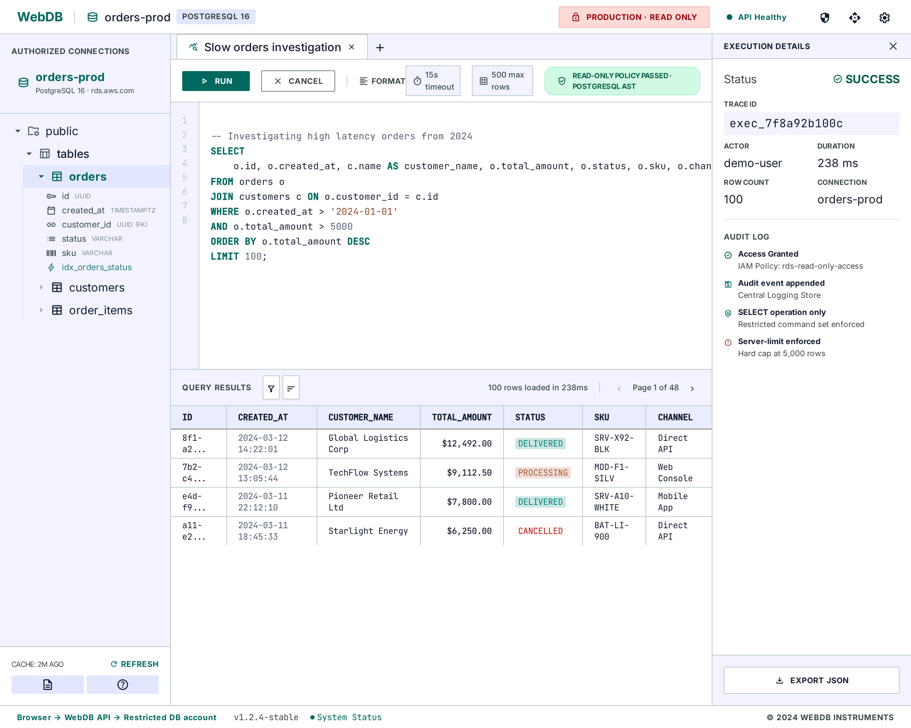

# WebDB MVP 前端基线：A · Quiet Precision

本目录把已选定的 Stitch 方案 **A · Quiet Precision** 固化为 WebDB P0 的前端设计交接包。MVP 第一版以**简体中文界面**为默认语言，同时按可切换英文的方式组织文案和布局。实现 Agent（包括 Claude Code）在开始 `apps/web` 工作前必须先阅读本文件、`DESIGN-SPEC.md` 和 `IMPLEMENTATION.md`。

## 权威顺序

如视觉稿与产品或安全规则冲突，按以下顺序执行：

1. 用户当前指令
2. 根目录 `AGENTS.md` 与 `CLAUDE.md`
3. 已接受 ADR 和 `webdb-design-draft.md`
4. `frontend-design/IMPLEMENTATION.md`
5. `frontend-design/DESIGN-SPEC.md`
6. Stitch 截图与 HTML 参考

截图和 HTML 只定义视觉方向，不得把其中的演示数据、外部 CDN、静态交互或超出 P0 的按钮直接复制为生产实现。

## 设计来源

- Stitch 项目：[WebDB P0 MVP · Frontend Concepts](https://stitch.withgoogle.com/projects/6725385213740577969)
- Stitch Screen：`A · Quiet Precision`
- Screen ID：`e90e6c4ad75147af9625c373bf1573e3`
- Stitch 画布尺寸：`2560 × 2048`，目标实现以 `1440 × 1024` 桌面工作区为首要验收尺寸
- 视觉截图：[`quiet-precision.png`](./quiet-precision.png)
- Stitch 静态 HTML：[`quiet-precision-reference.html`](./quiet-precision-reference.html)
- 可复制的设计令牌：[`design-tokens.css`](./design-tokens.css)

## P0 产品范围

必须实现：

- 仅显示当前用户经 API 授权的 PostgreSQL/MySQL 连接
- 授权 Schema 树与刷新入口
- Monaco SQL 编辑器
- 只读 SQL 的运行、取消、超时和行数限制状态
- 服务端分页结果表格，单页上限 500 行
- 策略拒绝、超时、取消、限流（429）和普通失败的可理解反馈
- 执行摘要与追加式审计事实展示
- 始终可见的生产环境和只读状态
- 默认使用简体中文 UI；所有界面文案集中管理，为后续 `zh-CN` / `en` 切换预留结构

明确不实现：登录、实时协作、评论、行编辑、DML/DDL、生产写入、导出/下载、SSH 隧道、AI 助手、移动端、浏览器直连数据库。

## Stitch 参考稿的已知偏差

- 参考 HTML 中的 `EXPORT JSON` 是生成器误加内容，**必须删除，不得实现**。
- 参考 HTML 中的 `rds.aws.com` 是演示文本，**不得显示连接主机、端口或凭据**。
- 参考 HTML 使用 Tailwind CDN、Google Fonts CDN 和 Material Symbols，仅用于独立预览；实现不得据此擅自新增依赖。
- 参考截图和 HTML 是英文界面；MVP 实现以中文文案规范为准，但需保持相同的信息密度和视觉层级。
- 参考 HTML 的内容可编辑 `div` 不是 Monaco，实现必须使用任务卡指定的 Monaco。
- 演示行数、超时和审计文本不是 API 契约；真实 UI 必须渲染服务端返回的策略和执行状态。

## Claude Code 开始实现前

1. 阅读 `docs/tasks/P0-06-minimal-web-workbench.md`、ADR-001、ADR-002、ADR-005、ADR-007、ADR-008、ADR-010。
2. 检查 `apps/web` 和 `packages/contracts` 的实际状态，不假设脚本、框架或 API 已存在。
3. 先补充会失败的组件/浏览器测试，再做最小实现。
4. 不在前端复制 SQL 安全判定；前端只展示服务端策略结果。
5. 新增 UI 依赖前按 `AGENTS.md` 升级人工确认。
6. 不把中英文文案散落在组件中；至少通过统一 message catalog/字典访问文案。
