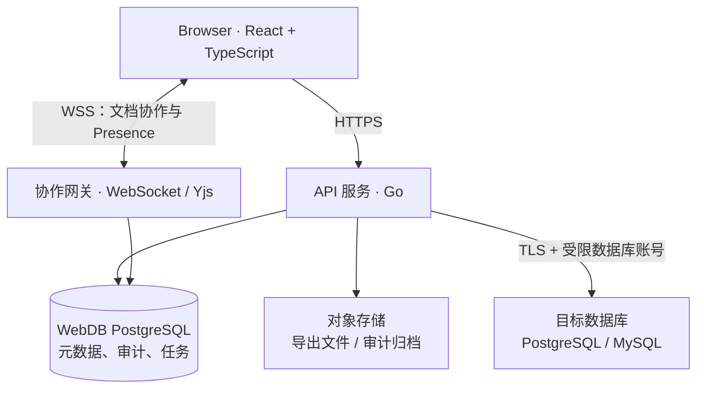
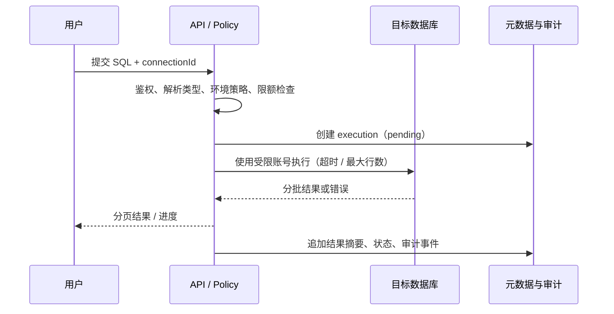

# WebDB — 浏览器中的协作式数据库工作台

> **状态**：设计草案 v0.3（待 POC 验证）  
> **日期**：2026-07-11  
> **目标**：先做一个安全、可自托管、适合团队共同排查和操作数据库的工作台；再逐步扩展为可视化数据库 IDE。

---

## 1. 摘要

WebDB 是一个自托管的 Web 数据库工作台，面向开发团队、DBA 和数据分析师。它连接到已有的 MySQL 或 PostgreSQL，在浏览器中提供 Schema 浏览、受控 SQL 执行、数据浏览与编辑、可共享的查询资产，以及实时协作。

产品的核心不是“把桌面数据库客户端搬到浏览器”，而是让团队围绕一次数据库操作形成**可见、可控、可追溯的工作上下文**：谁在看什么、谁准备执行什么、这条语句影响了多少行、是否经过审批、能否复现。

### 1.1 一句话定位

**WebDB = 面向团队的、安全可审计的数据库工作台。**

“Google Docs 式协作”只用于查询、笔记、看板和成员状态；对真实数据库的写操作仍由服务端串行执行、授权和审计。CRDT 解决文本内容的并发合并，不能替代数据库事务、约束或业务层并发控制。

### 1.2 首发用户与非目标

| 项目 | 选择 |
|---|---|
| 首发用户 | 3–30 人的软件团队：开发、技术负责人、DBA / 数据分析师混合协作 |
| 首发场景 | 排查线上问题、共享排查 SQL、在受控权限内浏览和小范围修复数据 |
| 首发部署 | 私有网络或 VPN 内的 Docker Compose 自托管实例 |
| 非目标 | 通用数据库协议代理、替代专业迁移系统、在生产库上实现离线数据编辑、第一阶段支持数十种数据库；v1 不做移动端适配或国际化 |

v1 仅保障 Chrome、Firefox、Edge 最近两个大版本的桌面端体验；移动端可访问不等于支持在手机上执行或编辑 SQL。

---

## 2. 问题、机会与假设

### 2.1 要解决的问题

1. 数据库连接、常用 SQL 和排查过程分散在个人电脑与聊天记录中。
2. 团队成员难以判断一条 SQL 是否安全、谁正在操作同一张表，以及执行结果是否可复现。
3. 共享连接经常意味着共享密码；权限、数据导出和修改缺乏统一审计。
4. 现有数据库 GUI 已能覆盖大量单人操作，WebDB 不能仅以“功能更多”取胜。

### 2.2 需要验证的产品假设

| 假设 | 验证方式 | 通过信号 |
|---|---|---|
| 团队愿意把排查 SQL 沉淀为共享资产 | 找 3 个真实团队访谈并试用 | 每个团队一周内保存 ≥10 条查询，且有 ≥2 人复用 |
| “协作上下文 + 审计”比实时改同一行更有价值 | 可点击原型 / POC 测试 | 用户优先选择共享查询、运行记录、评论和只读链接 |
| 自托管能降低接入生产库的顾虑 | 部署演练与安全评审 | 30 分钟内可在隔离环境连接测试库，密钥不离开服务端 |
| MySQL + PostgreSQL 足以验证需求 | 访谈统计 | ≥80% 目标团队能用两种引擎之一完成主流程 |

### 2.3 竞品调研校正

草案原先“没有一个人做实时协作”的绝对表述不成立，也不宜作为产品前提。CloudBeaver 已提供团队、连接分配和数据编辑 / SQL 执行等权限控制；Outerbase Studio 已支持 MySQL、PostgreSQL、SQLite，并将团队协作定位于其云产品。因此，WebDB 的可验证差异化应是：**开源自托管环境中的实时共享工作上下文、受控执行与可审计变更闭环**，而不是泛称“支持团队”或“支持协作”。[CloudBeaver Teams 文档](https://dbeaver.com/docs/cloudbeaver/Teams/) [Outerbase Studio](https://outerbase.com/developers/outerbase-studio/)

### 2.4 价值主张

| 能力 | 用户收益 | 与常规 GUI 的区别 |
|---|---|---|
| 共享查询与运行记录 | 排查过程可复用、可交接 | 不只同步 SQL 文本，还保留执行上下文 |
| 操作前预览与策略校验 | 降低误改生产数据的风险 | 将“能执行”分为“允许执行、需确认、需审批” |
| 连接与权限分离 | 用户获得最小必要能力，不接触原始密码 | WebDB 授权与目标库账号权限共同生效 |
| Presence 与评论 | 团队能看到正在进行的排查 | 协作对象是工作项，不是盲目同步数据库状态 |

---

## 3. 范围与路线图

### 3.1 范围原则

- 先读后写：只读查询、Schema 浏览和共享查询先达到可靠；写入能力后置且默认收紧。
- 先 SQL 后图形：可视化 Schema 设计器是后续增值功能，不阻塞核心工作流。
- 先两种引擎：v1 仅支持 PostgreSQL 14+ 与 MySQL 8.0+；SQLite 作为本地文件场景另立设计，不与网络连接混为一谈。
- 先服务端执行：浏览器永不直连目标数据库，浏览器也永不获得数据库密码。

### 3.2 分期交付

| 阶段 | 周期（建议） | 交付物 | 明确不做 |
|---|---:|---|---|
| P0：可行性 POC | 2 周 | PG/MySQL 连接、Schema 拉取、只读 SQL、游标分页、审计事件 | 登录、协作、行编辑 |
| P1：个人工作台 | 4–6 周 | 登录、连接管理、查询编辑器、结果表格、收藏与历史、CSV 导出 | SSH 隧道、写操作、多人编辑 |
| P2：团队协作 | 4–6 周 | 工作区、RBAC、共享查询、评论、Presence、Yjs 文本协作 | CRDT 同步真实数据行 |
| P3：受控变更 | 4–6 周 | DML 预览、影响行数、二次确认、审批、审计导出、乐观并发控制 | 自动回滚承诺、任意 DDL 图形化编辑 |
| P4：高级体验 | 以后 | ER 图、Schema diff、查询模板、可视化、AI 辅助、OIDC / SSO，以及经安全评估的 SSH / 跳板机连接 | 将 AI 作为可绕过权限的执行入口 |

### 3.3 P1 的“完成”定义

- PostgreSQL 和 MySQL 均可完成连接测试、库表浏览、只读查询和 CSV 导出。
- 查询结果支持服务端游标 / keyset 分页；单页默认最多 500 行、导出单独走异步任务。
- 已持久化的查询结果默认保留 7 天，到期后由后台任务删除；执行元信息与审计事件按其各自留存策略保留。
- 每次连接测试、查询执行、导出均写入审计事件；审计不可由普通成员修改。
- 连接凭证只以加密密文存储，API 和浏览器响应均不返回明文。
- 一条 `docker compose up -d` 可启动最小部署；提供演示数据库和健康检查。

---

## 4. 核心用户旅程

### 4.1 排查并共享一次慢查询

1. 成员在工作区打开一个已授权的只读连接。
2. 在查询页编写 SQL；同一文档的协作者可看到光标和草稿，并可评论。
3. 点击“运行”后，服务端解析语句类型、应用工作区策略、设置超时和最大返回行数，再通过受限连接执行。
4. 结果集、耗时、行数、执行计划摘要和 SQL 版本形成一次运行记录；敏感字段按策略脱敏。
5. 成员将记录固定到事件 / 工单，其他成员可复制 SQL 或在自己的权限范围重新运行。
6. 一周后，成员可按文档正文、标签、连接、作者和时间范围找到该查询；运行记录可回链到其文档和对应版本。

### 4.2 受控修改一行数据（P3）

1. 用户在表格编辑单元格，前端只创建“变更草稿”，不直接写库。
2. 服务端验证主键、列权限、SQL 类型和工作区策略，展示旧值 / 新值 / 预计影响范围。
3. 用户确认；高风险环境或超过阈值时进入审批，而非立即执行。生产环境的写操作由 `Owner` 或 `Admin` 审批。
4. 服务端在事务中使用主键与版本条件写入；受影响行数为 0 时返回冲突，要求用户刷新并人工合并。
5. 写入后记录前后摘要、操作者、审批者、目标连接、语句指纹和结果。敏感值不进入审计正文。

> 不在 v1 承诺“多人同时编辑同一行自动合并”。数据库行的业务冲突应由约束、事务和显式冲突处理解决；CRDT 仅用于 SQL / 笔记等文档内容。

---

## 5. 功能设计

### 5.1 P1 功能清单

| 模块 | 必须具备 | 关键约束 |
|---|---|---|
| 身份与工作区 | 本地账号、工作区、成员邀请 | 管理员不能读取成员密码；完整版本接入 OIDC / SSO |
| 连接管理 | PG/MySQL、TLS、连通性测试、标签、环境标记 | 凭证加密；生产环境默认只读 |
| Schema 浏览 | 库、schema、表、列、主键 / 外键 / 索引、刷新 | 元数据按连接缓存并带失效时间 |
| SQL 工作台 | Monaco、多标签、格式化、语法高亮、历史与收藏；查询全文搜索与时间线浏览 | 补全来源于已授权 Schema，不能泄露其他连接元数据；搜索按连接、标签、作者、时间范围筛选 |
| 结果浏览 | 服务端分页、排序 / 筛选、列宽与隐藏、复制 | 禁止“SELECT * 无上限”拖垮服务 |
| 导出 | CSV 异步导出、下载一次性链接 | 行数上限、字段脱敏、审计、过期清理 |
| 审计 | 执行、导出、权限和连接事件 | 追加写；可按工作区和连接检索 |

### 5.2 P2 协作对象

| 对象 | 是否 CRDT | 说明 |
|---|---|---|
| SQL 文本与运行笔记 | 是 | Yjs `Y.Text`；版本快照和 Presence 独立存储；单文档以 10 位同时编辑者为初始上限 |
| 光标、选区、在线状态 | 否（临时状态） | WebSocket presence，不持久化，不作为审计事实；超出协作上限时降级为成员列表与低频状态刷新 |
| 查询元数据、标签、权限 | 否 | 服务端事务写入；避免 CRDT 引入权限竞态 |
| 查询运行记录与审计 | 否 | 服务端生成的不可变事实 |
| 真实数据库数据行 | 否 | 通过数据库事务、锁与乐观并发控制维护一致性 |

Yjs 是成熟的共享数据类型 / CRDT 库，适合文档、光标和离线同步；它本身不提供目标数据库的事务语义或访问控制。[Yjs 文档](https://docs.yjs.dev/)

### 5.3 权限模型

权限采用“工作区角色 + 连接能力 + 环境策略 + 目标数据库原生权限”的交集：任一层拒绝，操作即拒绝。

| 能力 | Owner | Admin | Editor | Viewer |
|---|---:|---:|---:|---:|
| 管理成员、工作区策略 | ✓ | ✓ | — | — |
| 管理连接与凭证 | ✓ | ✓ | — | — |
| 浏览 Schema / 运行只读 SQL | ✓ | ✓ | ✓ | ✓（可配置） |
| 保存、共享查询 | ✓ | ✓ | ✓ | 仅个人草稿 |
| 导出数据 | ✓ | ✓ | 可配置 | — |
| 执行 DML | ✓ | 可配置 | 可配置 | — |
| 审批高风险变更（含生产写操作） | ✓ | ✓ | — | — |

初版将 `Viewer` 默认为只读且禁止导出；生产连接默认禁止 DDL 与 DML，必须由管理员按连接显式放开。

---

## 6. 架构设计

### 6.1 总体架构

**边界说明**：API 服务是唯一连接目标数据库的组件。WebSocket 只用于协作与进度推送，不应将“每个数据库连接对应一个 WebSocket”作为设计前提。一次 SQL 执行是有界的服务端任务：创建执行上下文、获取受限连接、执行 / 流式返回、关闭或归还连接。

### 6.2 服务划分

| 组件 | 职责 | v1 实现建议 |
|---|---|---|
| Web 前端 | 交互、编辑、结果显示；不含 DB 密钥 | React + TypeScript + Monaco |
| API / 执行服务 | 认证、授权、策略检查、SQL 执行、审计、连接池与执行队列 | Go；先模块化单体，避免过早拆微服务；按目标连接配置 `max_open`、`max_idle`、最大生命周期、获取超时与并发执行上限 |
| 协作网关 | Yjs 房间鉴权、文档持久化、Presence | 可独立 Node 服务；或选择兼容实现，明确鉴权钩子 |
| 元数据服务 | 用户、工作区、连接配置、查询、审计、审批 | PostgreSQL + 数据库迁移工具 |
| 异步任务 | 大导出、Schema 刷新、审计归档 | 先以 Postgres 队列表实现，规模上来再引入队列 |

### 6.3 技术选择与待验证项

| 层 | 选择 | 决策理由 / 验证项 |
|---|---|---|
| 前端 | React 18+、TypeScript、Monaco | 生态成熟；验证编辑器补全与大结果集渲染 |
| 表格 | AG Grid Community 或 TanStack Table + 虚拟列表 | AG Grid Community 采用 MIT 许可证；需要先确认社区版功能是否覆盖筛选与编辑需求，避免隐式依赖企业功能。[许可证](https://www.ag-grid.com/eula/AG-Grid-Community-License.html) |
| 后端 | Go + `pgx` / MySQL 驱动 | 直接使用数据库驱动与连接池；不把“数据库协议代理”纳入 MVP |
| 协作 | Yjs + 有持久化、鉴权能力的 WebSocket provider | 对 SQL 文本做协作 POC，验证断线恢复、房间隔离、快照与负载 |
| 元数据 | PostgreSQL | 事务、JSONB、全文搜索与审计查询均适配 |
| 认证 | MVP 使用本地账号 + Cookie 会话或短时 access token / refresh token；完整版本接入 OIDC / SSO | 不把“JWT”当作完整安全方案；必须包含撤销、轮换、CSRF 策略与身份映射 |
| 部署 | Docker Compose；生产提供反向代理示例 | 将镜像体积列为优化指标而非功能承诺 |

### 6.4 SQL 执行管线

执行策略的最低要求：

- 单语句执行；拒绝或显式拆分多语句请求，避免 `SELECT; DROP ...` 绕过检查。
- PostgreSQL 与 MySQL 分别使用对应方言解析器判断语句类型和策略；不强行限制为两者共同 SQL 子集。无法可靠解析或判定的语句默认拒绝；字符串前缀匹配只能作辅助提示，不能作安全边界。
- 每次执行设置连接级超时、最大扫描 / 返回行数和取消能力；查询取消应映射到数据库侧取消。
- 默认只允许 `SELECT` / `EXPLAIN`；`INSERT` / `UPDATE` / `DELETE` / DDL 走单独策略与审批路径。
- 所有 SQL 都以目标库的最小权限服务账号执行；WebDB 的 RBAC 不能越过数据库原生权限。

### 6.5 连接池、排队与速率限制

连接池是每个目标连接（或等价的连接配置）独立管理的受限资源，而不是无限共享的全局池。P0 必须将以下配置做成有默认值、可观测、可覆盖的策略：

| 控制项 | 初始默认 / 行为 | 目的 |
|---|---|---|
| `max_open` | 每目标连接 10；由部署者按目标库容量调整 | 为 WebDB 设定硬上限，避免抢占业务连接 |
| `max_idle` | 每目标连接 2 | 降低闲置连接压力，同时保留常用连接 |
| 最大连接生命周期 | 30 分钟并加入抖动 | 避免长期连接遇到凭证轮换或网络半开 |
| 获取连接超时 | 5 秒 | 超时即返回 `429` 与“目标连接繁忙，请稍后重试”提示，不无限排队 |
| 并发执行上限 | 每用户 2、每工作区 10、每连接 5（初始值） | 防止单个用户或工作区耗尽资源 |
| 执行队列 | 不设无界队列；达到并发上限立即拒绝 | 让调用方重试，避免延迟与内存无界增长 |
| API 速率限制 | 按用户、工作区、连接三维令牌桶；执行接口单独限额 | 限制误用和恶意高频调用 |

以上数字是 P0 的保守起点，不是固定容量承诺。POC 压测应根据目标数据库的最大连接数、应用业务连接预算和查询负载重新校准；配置变更应写入审计。

---

## 7. 数据模型（WebDB 元数据库）

以下为逻辑模型；字段类型、索引与迁移在实现设计中细化。

| 实体 | 关键字段 | 说明 |
|---|---|---|
| `users` | `id`, `email`, `password_hash`, `status` | 用户身份；密码只保存强哈希 |
| `workspaces` | `id`, `name`, `settings` | 团队租户与默认策略边界 |
| `workspace_members` | `workspace_id`, `user_id`, `role` | 成员与角色 |
| `connections` | `id`, `workspace_id`, `engine`, `host`, `port`, `database`, `environment`, `secret_ref` | 不保存明文密钥；连接参数可分级脱敏 |
| `connection_policies` | `connection_id`, `allow_read`, `allow_write`, `allow_export`, `statement_timeout_ms` | 连接级安全策略 |
| `query_documents` | `id`, `workspace_id`, `title`, `owner_id`, `tags`, `search_vector`, `yjs_state_ref` | 协作 SQL 文档及其快照引用；`search_vector` 用 PostgreSQL `tsvector` 支持全文检索 |
| `query_versions` | `id`, `document_id`, `content`, `created_by` | 可读版本快照；不把临时 Presence 写入其中 |
| `executions` | `id`, `connection_id`, `document_id`, `query_version_id`, `statement_hash`, `status`, `started_at`, `duration_ms`, `row_count`, `result_ref`, `result_expires_at` | 一次运行的元信息与结果摘要，可回链到文档及其执行时版本；持久化结果默认 7 天后删除 |
| `change_requests` | `id`, `execution_id`, `risk_level`, `status`, `approved_by` | 受控写入 / 审批流程 |
| `audit_events` | `id`, `workspace_id`, `actor_id`, `action`, `resource`, `metadata`, `occurred_at` | 追加式审计；元数据必须脱敏 |
| `export_jobs` | `id`, `execution_id`, `status`, `object_ref`, `expires_at` | 异步导出与自动清理 |

建议的强制唯一约束包括：`workspace_members(workspace_id, user_id)`、同一工作区的连接名称、邀请 token 的哈希。`audit_events` 不提供普通业务 API 的更新 / 删除能力。

---

## 8. 安全、合规与运维基线

### 8.1 威胁与控制

| 风险 | 控制措施 | 验证方式 |
|---|---|---|
| 数据库凭证泄露 | 服务端信封加密（DEK + 可轮换 KEK）、最小权限 DB 账号、日志脱敏、浏览器永不下发密钥 | 密钥轮换演练；日志扫描 |
| 越权访问连接或查询 | 工作区隔离、资源级授权、连接策略、目标库原生权限 | 跨工作区 / 跨连接授权测试 |
| 误操作生产库 | 环境醒目标识、默认只读、写操作预览 / 确认 / 审批、超时和行数阈值 | E2E 策略测试 |
| SQL 注入 / 策略绕过 | 单语句限制、SQL AST 解析、参数化模板、拒绝危险语句类别 | 模糊测试与回归用例 |
| 敏感数据导出 | 导出权限、字段脱敏、数量上限、短期签名链接、审计 | 导出权限与过期链接测试 |
| 会话劫持 | HTTPS、Secure / HttpOnly Cookie、CSRF 防护或等效 token 策略、会话撤销 | 安全测试清单 |
| 审计被篡改 | 追加写、访问权限分离、定期导出归档；可选哈希链 | 审计完整性抽样校验 |
| API 滥用 / 连接池耗尽 | 按用户 + 工作区 + 连接限流；并发执行上限；受限连接池、获取超时与无界队列禁止 | 限流、429、取消与池耗尽压力测试 |

### 8.2 运行指标（初始 SLO）

这些是可测量的初始目标，不是未经验证的市场承诺：

| 指标 | 初始目标 |
|---|---|
| API 健康检查可用性 | 月度 ≥99.5%（自托管环境按实例统计） |
| 元数据 API P95 | <300 ms（不含目标库执行时间） |
| 首屏 Schema 导航 | 测试库 <2 秒，使用缓存后 <500 ms |
| 查询取消 | 用户取消后 5 秒内释放 / 终止服务端任务（受驱动能力约束） |
| 审计写入 | 每次执行在完成前或完成时持久化，失败必须显式告警 |
| 备份 | 元数据库每日备份；恢复演练至少每季度一次 |

### 8.3 可观测性

- 结构化日志：请求 ID、工作区 ID、执行 ID；禁止记录密码、完整敏感结果集和未脱敏参数。
- 指标：活跃连接池、执行队列、慢查询、执行失败率、WebSocket 房间数、导出队列、审计写入失败。
- 追踪：从浏览器请求到执行任务、目标数据库调用和审计落库串联同一 trace ID。
- 告警：审计写入失败、密钥解密失败、连接失败突增、超时突增、导出异常增长。

---

## 9. 测试与验收策略

| 层级 | 覆盖重点 |
|---|---|
| 单元测试 | SQL 分类、策略决策、RBAC 矩阵、脱敏、密钥封装、分页 token |
| 集成测试 | PostgreSQL / MySQL 驱动、超时 / 取消、事务、元数据库迁移、对象存储 |
| E2E 测试 | 登录、连接、Schema 浏览、只读执行、导出、协作编辑、跨工作区越权拒绝 |
| 安全测试 | 多语句绕过、注释绕过、越权 ID、敏感日志、CSRF、会话撤销 |
| 性能测试 | 100 并发只读执行、10 万行分页浏览、多人编辑同一 SQL 文档 |
| 恢复演练 | 元数据库从备份恢复、Yjs 文档快照恢复、导出过期清理 |

P0 结束前必须有两项硬门槛：

1. 任意浏览器请求均无法获得或恢复目标数据库明文密码。
2. 取消、超时和连接归还不会导致连接池耗尽；PG 与 MySQL 各有自动化回归测试。

---

## 10. 主要风险与决策记录

| 风险 / 决策 | 等级 | 处理方式 |
|---|---:|---|
| 多方言 SQL 与元数据差异 | 高 | P0 只实现 PG / MySQL 的共同子集；引擎差异通过 adapter 隔离；每类能力设支持矩阵 |
| 协作与数据一致性被混淆 | 高 | CRDT 仅处理文档；真实数据写入走数据库事务与显式冲突机制 |
| 密钥生命周期设计不足 | 高 | 从第一版实现 `secret_ref`、加密、轮换与日志脱敏；不能以“加密存储”一句带过 |
| 大结果集导致内存耗尽 | 高 | 流式读取、分页、上限、异步导出；禁止后端全量缓存结果 |
| 连接池配置不当 | 高 | P0 前确定每类连接的上限、超时、拒绝策略与监控；压测后校准默认值 |
| AG Grid 社区版功能缺口 | 中 | 在 UI 定型前做 POC；若关键能力依赖企业版，评估替代方案或预算 |
| 目标库网络不可达 | 中 | 明确部署拓扑；P1 只支持 WebDB 服务可直连的私网数据库，SSH 隧道后置 |
| 大型 SQL 文档编辑卡顿 | 中 | P2 前用 5,000+ 行文档做 Monaco POC；超过阈值时提示拆分文档，并保留只读查看能力 |
| 单文档 Presence 过载 | 中 | 初始限制 10 人同时编辑；超限降级 Presence 并记录容量指标，再决定扩容方案 |
| “镜像 <200MB”过早约束 | 低 | 记录构建体积并优化多阶段镜像，但不牺牲安全性和可维护性 |

### 10.1 P0 前已确认的关键决策

1. **已决定**：首发版本允许连接生产库，且生产连接默认只读。生产环境写操作须由 `Owner` 或 `Admin` 审批。
2. **已决定**：首发自托管版的密钥根（KEK）通过部署环境变量注入；企业版接入企业密钥管理服务。实现时不得将 KEK 写入配置文件、镜像、日志或元数据库。
3. **已决定**：持久化查询结果默认保留 7 天，到期自动删除；执行元信息和审计事件不随结果删除。
4. **已决定**：MVP 使用本地账号登录；完整版本接入 OIDC / SSO。MVP 的用户与工作区模型需预留外部身份主体、提供商与租户映射字段。
5. **已决定**：项目采用 Apache License 2.0；P0 建立依赖许可证清单与 `NOTICE` 维护机制，贡献规范须与该许可证兼容。
6. **已决定**：PostgreSQL 与 MySQL 分别采用对应方言解析器；不限制为共同 SQL 子集；任何无法可靠解析或判定的语句默认拒绝。
7. **已决定（P0 默认）**：每个目标连接 `max_open=10`、`max_idle=2`、最大连接生命周期 30 分钟、获取连接超时 5 秒；每用户 / 工作区 / 连接并发执行上限分别为 2 / 10 / 5；超限立即返回 429。POC 压测后可按目标库业务连接预算校准。

---

## 11. P0 实施清单

- [x] 建立 monorepo：`apps/web`、`apps/api`、`packages/contracts`、`deploy/compose`、`docs/adr`。（P0-01，PR #2）
- [ ] 添加 Apache License 2.0 的 `LICENSE`、`NOTICE` 与第三方依赖许可证清单。
- [ ] 为 PostgreSQL 和 MySQL 编写统一 adapter 接口：连接测试、列出 Schema、只读执行、取消、分页。
- [ ] 创建元数据库迁移：用户、工作区、成员、连接、策略、执行、审计。
- [ ] 实现凭证加密与日志脱敏；为密钥轮换预留版本字段。
- [ ] 实现只读 SQL 策略：单语句、按 PostgreSQL / MySQL 方言分别进行 AST 分类、超时、最大行数、取消；无法可靠判定的语句默认拒绝。
- [ ] 实现目标连接池与执行准入：上限、获取超时、429、取消、指标和压力测试。
- [ ] 制作最小 React 页面：连接列表、Schema 树、Monaco、结果表格。
- [x] 用 Docker Compose 启动 WebDB 元数据库、演示 PG、演示 MySQL 和应用。（P0-01，PR #2）
- [ ] 写出 P0 验收脚本和威胁模型；通过后再启动协作功能。

---

## 附录 A：架构决策记录（ADR）索引

| ADR | 决策 | 状态 |
|---|---|---|
| ADR-001 | 浏览器不直连目标数据库 | 已接受 |
| ADR-002 | v1 仅支持 PostgreSQL 和 MySQL | 已接受 |
| ADR-003 | CRDT 仅用于协作文档，不同步真实数据行 | 已接受 |
| ADR-004 | 模块化单体优先于微服务 | 已接受 |
| ADR-005 | 首发允许连接生产库；生产连接默认只读；写操作由 Owner 或 Admin 审批 | 已接受 |
| ADR-006 | 首发 KEK 通过部署环境变量注入；企业版对接企业密钥管理服务 | 已接受 |
| ADR-007 | PostgreSQL 与 MySQL 分别使用方言解析器；不限制为共同 SQL 子集；无法可靠判定的语句默认拒绝 | 已接受 |
| ADR-008 | P0 连接池与执行准入默认策略：10 / 2 / 30 分钟 / 5 秒；并发 2 / 10 / 5；超限返回 429 | 已接受 |
| ADR-009 | SSH / 跳板机连接的安全拓扑 | 后续评估 |
| ADR-010 | 持久化查询结果默认保留 7 天，到期自动删除 | 已接受 |
| ADR-011 | MVP 使用本地账号；完整版本接入 OIDC / SSO | 已接受 |
| ADR-012 | 项目采用 Apache License 2.0 | 已接受 |

## 附录 B：参考资料

- [CloudBeaver Teams 与连接 / 权限管理](https://dbeaver.com/docs/cloudbeaver/Teams/)
- [Outerbase Studio：支持的数据库与产品能力](https://outerbase.com/developers/outerbase-studio/)
- [Yjs：协作共享数据类型与 CRDT 文档](https://docs.yjs.dev/)
- [AG Grid Community MIT License](https://www.ag-grid.com/eula/AG-Grid-Community-License.html)
